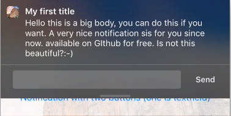
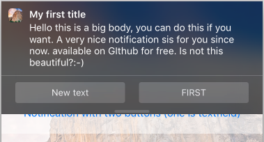
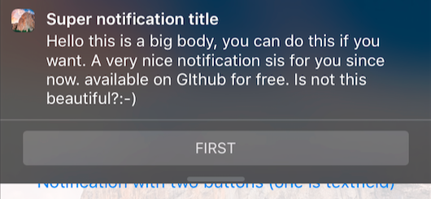
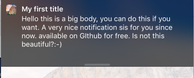
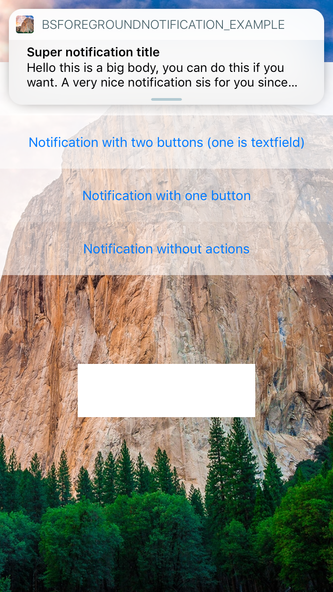
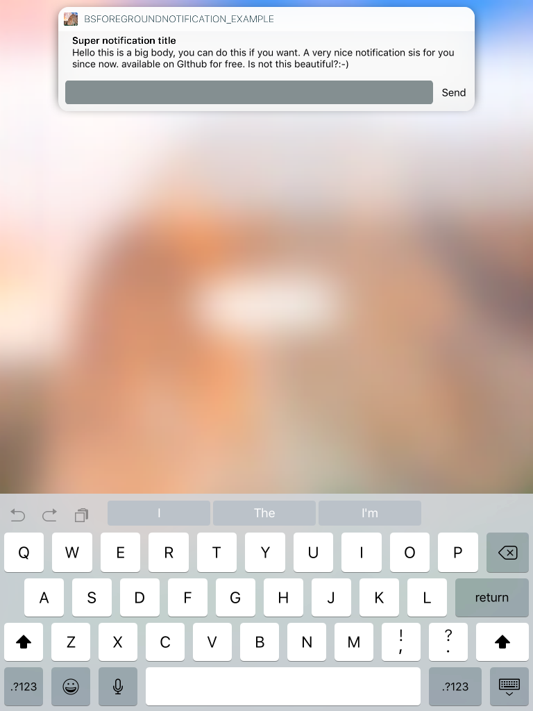

# ForegroundNotification








## Usage

To run the example project, clone the repo, and run `pod install` from the Example directory first.

## Installation

ForegroundNotification is available through [CocoaPods](http://cocoapods.org/pods/BSForegroundNotification). To install
it, simply add the following line to your Podfile:

```ruby
pod "BSForegroundNotification"
```

If you used `use_framework` in your podfile just simply do:

```Swift
import ForegroundNotification

```

for every file when you need to use it.

you may also use:

```Swift
@import ForegroundNotification

```
within **bridging header** file and avoid to import framework for every needed file.

##Info

- entirely written in latest Swift syntax. Works with iOS 8 and 9 and Xcode7.
- to present local foreground notification, both `alertTitle` and `alertBody` cannot be nil
- to present remote foreground notification, both `title` and `body` cannot be nil in `alert` dictionary. In case when `alert` is a string, that string cannot be empty.

##Usage

######Simply create your foreground notification object with on of three ways:

```Swift
let notification = ForegroundNotification(userInfo: userInfo) //remote
let notification = ForegroundNotification(localNotification: localNotification) //local
let notification = ForegroundNotification(titleLabel: "title", subtitleLabel: "subtitle", categoryIdentifier: "category") //custom initializer
```

######Set a default static properties:

```Swift
ForegroundNotification.timeToDismissNotification = 4
ForegroundNotification.systemSoundID: SystemSoundID = 1001
```

######Set delegate which conform to protocol `BSForegroundNotificationDelegate`:

Note that `ForegroundNotificationDelegate` inherits from `UIApplicationsDelegate`

```Swift
notification.delegate = self
```

######Implement optional methods of `ForegroundNotificationDelegate`


```Swift
@objc public protocol ForegroundNotificationDelegate: class, UIApplicationDelegate {

    optional func foregroundRemoteNotificationWasTouched(with userInfo: [AnyHashable: Any])
    optional func foregroundLocalNotificationWasTouched(with localNotification: UILocalNotification)
}
```

######Then present notification:

```Swift
notification.presentNotification()
```

######If it is needed one of `ForegroundNotificationDelegate`'s method is called':

```Swift
func application(application: UIApplication, handleActionWithIdentifier identifier: String?, forRemoteNotification userInfo: [AnyHashable: Any], completionHandler: () -> Void)
func application(application: UIApplication, handleActionWithIdentifier identifier: String?, forRemoteNotification userInfo: [AnyHashable: Any], withResponseInfo responseInfo: [AnyHashable: Any], completionHandler: () -> Void)
func application(application: UIApplication, handleActionWithIdentifier identifier: String?, forLocalNotification notification: UILocalNotification, completionHandler: () -> Void)
func application(application: UIApplication, handleActionWithIdentifier identifier: String?, forLocalNotification notification: UILocalNotification, withResponseInfo responseInfo: [AnyHashable: Any], completionHandler: () -> Void)
```

## Author

Bartłomiej Semańczyk, bartekss2@icloud.com

## License

`BSForegroundNotification` is available under the MIT license. See the LICENSE file for more info.
